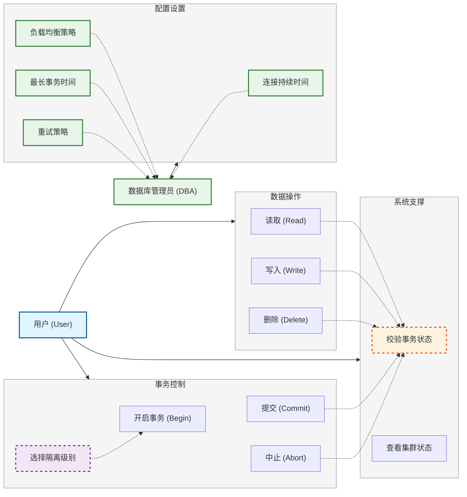
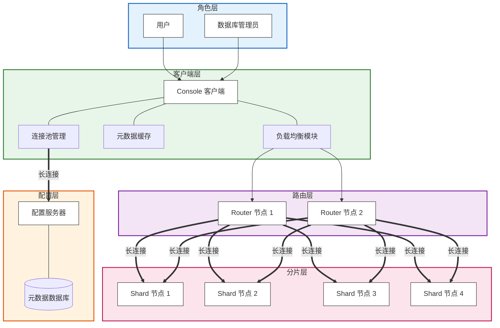
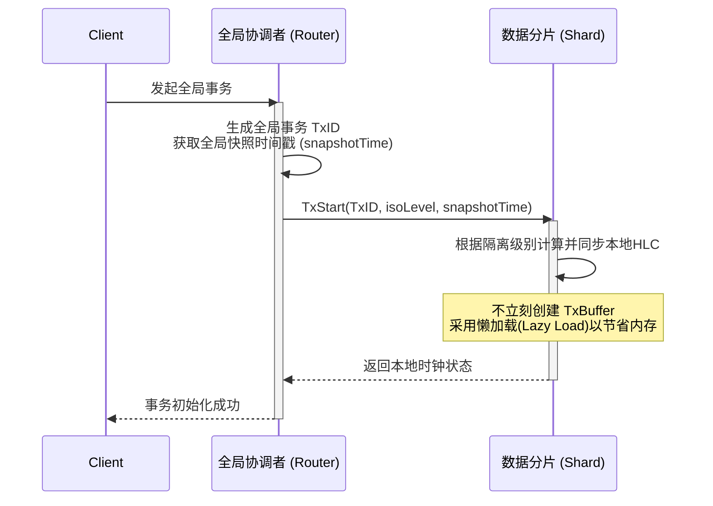
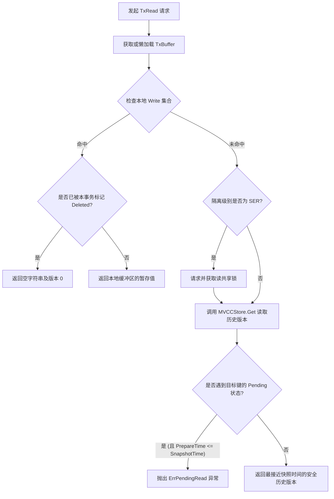
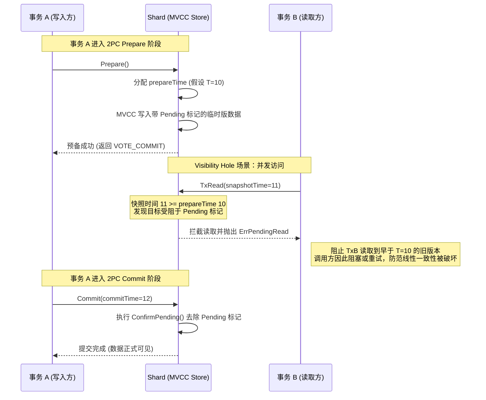
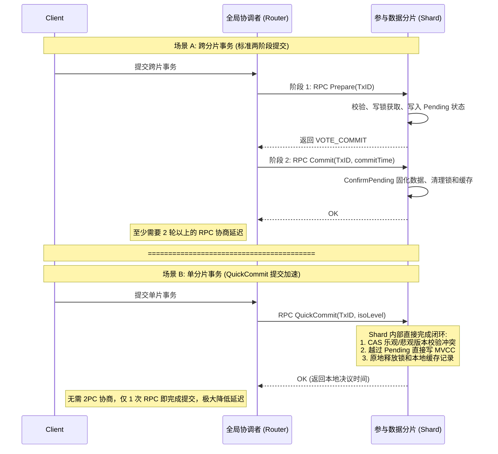

# 用例图

# 总体架构图

# 1. 组件交互图：事务初始化时的状态分离与通信架构

对应 TODO 1，展示 Router 和 Shard 在 `TxStart` 阶段的职责划分。

#  流程图：TxRead 的多分支判断逻辑

# 时间线时序图：2PC Visibility Hole 与 异常拦截防线

# 交互时序图：标准 2PC 与 QuickCommit 性能对比

