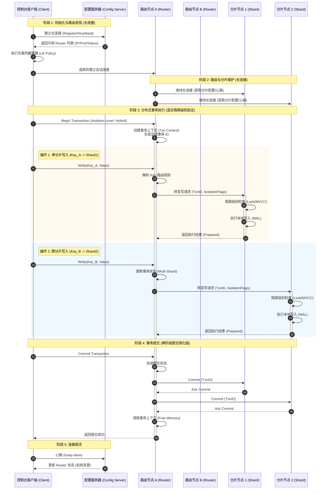

sequenceDiagram
    autonumber
    participant Client as 控制台客户端 (Client)
    participant Config as 配置服务器 (Config Server)
    participant Router1 as 路由节点 A (Router)
    participant Router2 as 路由节点 B (Router)
    participant Shard1 as 分片节点 1 (Shard)
    participant Shard2 as 分片节点 2 (Shard)

