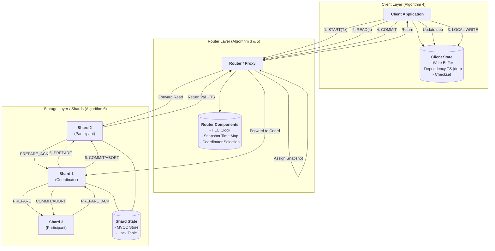

# A Framework for Transactional Consistency Models with Atomic Visibility

核心关系 (Key Relations)：

- 可见性 (Visibility, VIS)：T1 VIS T2 表示事务 T2 “看到”了事务 T1 的更新。

- 仲裁 (Arbitration, AR)：T1 AR T2 是一个全局的总序关系，用于解决并发事务写冲突，定义了哪个事务的写入版本“更新”。

- 原子可见性 (Atomic Visibility)：论文框架利用了一个关键特性——“原子可见性”，即一个事务的所有更新要么对另一个事务全部可见，要么全部不可见 。这极大地简化了规范，因为它允许在整个事务层面（而不是单个读写事件层面）定义 VIS 和 AR 关系。

VIS 是一种关系（$VIS \subseteq \mathcal{H} \times \mathcal{H}$），它被定义为一个前缀有限（prefix-finite）的非循环关系 。

- **含义：** $T \xrightarrow{VIS} S$ （或 T VIS S）的非正式含义是，事务 S “意识到了”事务 T。
- **影响：** 因此，T 的效果（如写入操作）可以影响 S 中操作的结果 。
- **实现方式：** 在实际实现中，这可能意味着 T 所执行的更新已经传递到了正在执行 S 的副本（replica）上 。
- **并发：** 如果两个事务没有通过 VIS 关联，它们就被称为“并发的”（concurrent）。

AR 也是一种关系（$AR \subseteq \mathcal{H} \times \mathcal{H}$），它被定义为一个前缀有限的“全序”（total order） 。

- **含义：** $T \xrightarrow{AR} S$ 意味着 S 写入的对象版本将“取代”（supersede）T 写入的版本 。例如，在图 3(a) 中，`comment`（来自 $T_2$）取代了 `empty`（来自 $T_1$） 。
- **实现方式：** 在实现中，仲裁关系可以通过为事务分配时间戳来建立

VIS 和 AR 之间存在一个关键的约束：**$AR \supseteq VIS$** 。这个约束确保一个事务 T 的写入，会取代所有 T 已经“意识到的”（VIS）事务的写入 


通过为 `VIS` 和 `AR` 关系设定不同的约束（公理）来定义不同的模型。文中提到了几个关键公理：

* **Int (Integrity)**: 保证事务的原子性。一个事务的提交事件必须在其所有操作之后。
* **Ext (External Consistency)**: 这是核心的“原子可见性”公理。它规定，当一个事务T2读取一个值时，这个值必须来自`VIS`关系中“最新”的、在`AR`顺序下“最晚”的那个写入事务。
* **TransVis (Transitive Visibility)**: 要求可见性关系是传递的。如果T1被T2看到，T2被T3看到，那么T1也必须被T3看到。
* **NoConflict (无冲突)**: 要求对于任何两个更新了相同对象的事务，它们在`VIS`关系中必须有明确的顺序（一个看到另一个，或反之）。
* **Prefix (前缀)**: 要求`AR`顺序是`VIS`顺序的扩展，即`VIS`的顺序必须与`AR`的全局顺序一致。


公理化方法 (Axiomatic Approach)：借鉴弱内存模型的研究方法，使用“抽象执行”（Abstract Executions）来描述数据库的计算过程 。一个抽象执行由一系列事务事件以及它们之间的关系构成 。


好的，这篇论文《A Framework for Transactional Consistency Models with Atomic Visibility》提出了一个统一的、声明式的框架，用于形式化地定义和比较现代分布式数据库中的各种事务一致性模型（也就是我们常说的隔离级别）。

接下来，我将为您详细解读这篇论文的核心思想、它定义的隔离级别以及这些级别下的事务约束。

论文概述
1. 问题背景
   现代分布式数据库为了实现高可用性和可扩展性，常常采用数据复制技术，并在多个副本上处理事务 。然而，要保证所有副本上的事务执行都像在单一数据库上串行执行一样（即“可串行化”，Serialisability），需要在副本间进行大量协调，这会严重影响性能和可用性 。因此，许多系统选择提供较弱的一致性保证，但这会导致各种“异常”（Anomalies）行为的出现 。问题在于，这些弱一致性模型的定义通常是模糊的、非正式的，或者是与特定的系统实现紧密耦合的，这给理解、比较和验证程序带来了巨大困难 。

2. 核心贡献
   为解决此问题，论文提出了一个统一的、声明式的规范框架 。其核心思想是：


通过定义一组约束这些关系（VIS 和 AR）的“公理”（Axioms），论文清晰地定义了不同的一致性模型 。一个数据库历史是合法的，当且仅当存在一个满足该模型所有公理的抽象执行 。


不同的一致性模型（隔离级别）及其约束
论文由弱到强定义了六个一致性模型。它们的关系是层层递进的，更强的模型是在更弱模型的基础上增加新的公理约束。

基础公理
所有模型都基于两个基础公理：

- INT (Internal Consistency)：确保事务内部的读写行为符合串行语义 。例如，一个事务如果先写了某个对象，再读这个对象，必须能读到自己刚刚写入的值。

- EXT (External Consistency)：定义了一个事务如何读取其他事务写入的值 。它规定，一个外部读取（即读取本事务从未写入过的对象）的值，取决于所有对它可见（通过 VIS 关系）的事务中，在 AR 顺序下最新的那个事务所写入的值。


这个公理是实现“原子可见性”的关键，它禁止了“脏读”和“分裂读”（Fractured Reads）异常。

1. Read Atomic (RA)

   公理: INT, EXT 

   约束: 这是最弱的一致性模型 。它只保证了原子可见性，即你不会只看到一个事务的部分更新 。

   允许的异常: 它允许几乎所有的其他异常，比如下图中的“因果违背”（Causality Violation）。在图 3(a) 中，T2 看到了 T1 的写入（read(x, post)），T3 看到了 T2 的写入（read(y, comment)），但 T3 却没有看到 T1 的写入（read(x, empty)），这违反了因果关系 

2. Causal Consistency (CC)

   公理: RA + TRANSVIS 

   约束: 在 RA 的基础上增加了 TRANSVIS 公理，要求 VIS 关系必须是可传递的 。这意味着，如果 T3 看到了 T2，且 T2 看到了 T1，那么 T3 必须也能看到 T1 。

   防止的异常: 这个约束正好防止了上述的“因果违背”异常 。

   允许的异常: 仍然允许“丢失更新”（Lost Update） 。如图 3(c) 所示，T1 和 T2 同时读取账户初始值，然后各自修改并写入，导致其中一个更新丢失了 。

3. Parallel Snapshot Isolation (PSI)

   公理: CC + NOCONFLICT 

   约束: 在 CC 的基础上增加了 NOCONFLICT 公理，该公理不允许写入同一对象的事务并发执行 。它们之间必须通过 VIS 关系确定一个先后顺序 。

   防止的异常: 这个约束有效防止了“丢失更新”异常 。因为 T1 和 T2 都写入了 acct 对象，它们不能并发，必须有一个能看到另一个的更新。

   允许的异常: 允许“长分叉”（Long Fork）异常 。如图 3(d) 所示，并发的 T1 和 T2 分别写入 x 和 y 。T3 只看到了 T1 的写入，而 T4 只看到了 T2 的写入 。从 T3 和 T4 的视角看，T1 和 T2 的发生顺序是不同的 。

4. Prefix Consistency (PC)

   公理: RA + PREFIX (此公理蕴含了 TRANSVIS) 

   约束: 这个模型从另一个维度增强了 CC。它增加了 PREFIX 公理，要求所有事务必须按照一个统一的全局顺序（即 AR 顺序）变得可见 。具体来说，如果一个事务 T 看到了 S，那么 T 必须也能看到在 AR 顺序中所有排在 S 之前的事务 。

   防止的异常: 这个“单一全局可见顺序”的约束防止了“长分叉”异常 。在图 3(d) 中，T1 和 T2 必须有一个 AR 顺序，假设是 T1 AR T2。那么根据 PREFIX，如果 T3 看到了 T2，它必须也看到 T1。

   允许的异常: 允许“写偏斜”（Write Skew） 。


5. Snapshot Isolation (SI)

   公理: PC + NOCONFLICT 

   约束: 这是 PSI 和 PC 的结合。它既要求写入同一对象的事务不能并发 (NOCONFLICT)，也要求所有事务的可见性遵循单一的全局顺序 (PREFIX)。

   防止的异常: 防止了丢失更新和长分叉。

   允许的异常: 仍然允许“写偏斜”（Write Skew） 。如图 3(e) 所示，两个事务各自读取数据，检查约束条件（acct1 + acct2 > 100），然后基于这个快照各自修改了不同的数据项，最终破坏了全局约束 。


6. Serialisability (SER)

   公理: RA + TOTALVIS 

   约束: 这是最强的隔离级别。它用 TOTALVIS 公理取代了其他所有约束，要求 VIS 关系必须是一个总序关系 。这意味着对于任意两个事务 T1 和 T2，要么 T1 VIS T2，要么 T2 VIS T1，它们之间不能并发。这 фактически 等同于所有事务按照某个串行顺序执行 。

   防止的异常: 防止了上述所有异常，包括写偏斜 。


好的，我们来分析一下论文第四章第一节“Operational Specification of Read Atomic”的主要内容和细节。

### 第四章第一节核心内容概述

该小节的核心目标是为论文中最弱的事务一致性模型——**Read Atomic**——提供一个**操作性规约（Operational Specification）**。

与第三章提出的**公理化规约（Axiomatic Specification）**不同，操作性规约更接近于实际系统的实现。它通过定义一个理想化的分布式数据库算法来描述系统行为 。这个算法模拟了数据库副本如何处理客户端请求、如何相互通信以及如何保证特定的数据一致性。作者们通过建立这种更具体的、算法化的模型，来验证其公理化模型的正确性和合理性 。 

### 细节讲解

本节详细描述了一个理想化的分布式数据库系统如何运行以实现 Read Atomic 一致性。其主要构成和运行机制细节如下：

1. **系统架构 (System Architecture)**:
   - **副本 (Replicas)**: 数据库由一组副本组成，每个副本都维护所有对象的完整拷贝 。副本的集合（用 `Rld` 表示）是无限的，以模拟动态创建新副本的场景 。
   - **通信 (Communication)**: 系统被假设为全连接的，即每个副本都可以向所有其他副本广播消息 。
2. **事务处理流程 (Transaction Processing Flow)**:
   - **本地执行**: 一个事务内的所有操作（读、写）最初都在单个副本上执行 。不同事务可以在不同副本上执行 。
   - **串行处理**: 为了简化模型，该算法假设每个副本内部是串行处理事务的，即不会交错执行多个事务 。作者指出，这并不失一般性，因为由单副本并发执行可能导致的异常，同样会因为副本间更新传播的异步性而出现 。
   - **提交与日志**: 当一个事务完成并决定**提交 (commit)** 时，执行该事务的副本会生成一条**事务日志 (transaction log)**，并将其广播给所有其他副本 。
   - **原子可见性 (Atomic Visibility)**: 事务的所有更新（写操作）都被包含在**单一消息**中发送，这确保了事务的**原子可见性**——即其他事务要么能看到该事务的所有更新，要么一个都看不到 。
3. **核心数据结构 (Key Data Structures)**:
   - **事务日志 (Transaction Log)**: 格式为 `t:ρ`。
     - `t`: 一个唯一的自然数，作为事务的**时间戳 (timestamp)**，用于确定不同对象版本的优先顺序，这对应于公理化模型中的 **AR (arbitration) 关系** 。
     - `ρ`: 一个更新列表 (`UpdateList`)，记录了事务中所有写操作的序列 。
   - **副本状态 (Replica State)**: 每个副本 `r` 的状态由一个二元组 `(D, l)` 表示。
     - `D`: 该副本的本地数据库拷贝，表现为一组它已提交或从其他副本收到的事务日志 (`LogSet`) 。
     - `l`: 当前正在执行的事务到目前为止的更新序列，或者为 `idle` 状态表示当前没有事务在执行 。
   - **系统配置 (System Configuration)**: 整个系统的状态由一个二元组 `(R, M)` 描述。
     - `R`: 一个映射，记录了每个副本的状态 。
     - `M`: 正在副本间传输的消息（即事务日志）池 。
4. **算法的动态行为 (Dynamic Behavior of the Algorithm)**: 该算法的行为由**图4 (Figure 4)** 中的一组**状态转移规则**定义，描述了系统配置如何响应客户端操作和消息接收等底层事件而发生变化 。
   - **(Start)**: 当客户端在副本 `r` 上启动一个新事务时，只有当 `r` 处于 `idle` 状态时才能开始。`r` 的状态会从 `idle` 变为空的更新序列 `ε` 。
   - **(Write)**: 客户端在副本 `r` 上执行写操作时，该操作会被追加到当前事务的更新序列 `ρ` 中 。
   - **(Read)**: 读操作返回的值由 `lastval` 函数决定。该函数会综合考虑副本本地数据库 `D` 中的已提交日志和当前事务 `ρ` 中的未提交写操作 。这确保了事务总是能读到自己的写操作（Read-your-writes），并且在一个事务内部不会读到其他并发事务的更新，从而避免了**不可重复读 (unrepeatable reads)** 。
   - **(Commit)**: 事务提交时，会被分配一个**大于**其所在副本 `r` 的数据库 `D` 中所有事务时间戳的新时间戳 `t` 。然后，该事务的日志 `t:ρ` 会被同时加入到副本 `r` 的本地数据库 `D` 和消息池 `M` 中 。在 Read Atomic 模型中，事务**总能成功提交** 。
   - **(Abort)**: 如果事务中止，其在副本 `r` 上的更新序列将被清空 。
   - **(Receive)**: 处于 `idle` 状态的副本 `r` 可以从消息池 `M` 中接收一个事务日志，并将其加入自己的本地数据库 `D` 中 。

总之，第四章第一节通过一个具体化的、包含副本、消息传递和状态转移规则的算法，详细地定义了 Read Atomic 一致性模型的操作语义。这个模型是后续章节中将更强一致性模型与之对比和关联的基础。


【


`tick()`用于同步时间

`noopWrite()`


let us define console command now:

1. start:`start isolationlevel` reply: `txnID`
2. read: `read key` key is a string: reply: `read result value` , if failed, reply:`failed`
3. write: `write key val` key is string val is int reply succeed or not
4. commit or abort the command result  when commit succeed all the operation list of operation 

implement load env logi in config.go. if this node is a tso, just config which port it runs on.
if this node is a replica, env list as follow:

```
- REPLICA_ID=node-1
- PORT=port
- TSO_ADDR=ip:port
- PEER1_ID=
- PEER1_ADDR=ip:port   
```



基于你目前的架构设计（HLC 时钟、Shard 端的 Prepared 阻塞逻辑、两阶段提交中的 X 锁），以及**可串行化级别采用乐观锁（OCC）**的决定，我们对这四个隔离级别的操作语义进行最终建模总结：

---

### 1. 前缀一致性 (Prefix Consistency / Causal Consistency)
**核心：** 保证因果链条不中断，追求极致延迟。

*   **开启事务**：`mongos` 获取会话记录的上次提交时间戳 $ T _{session} $。
*   **读写阶段**：
    *   **读**：Shard 保证返回版本 $V \ge T_{session}$ 的数据。基于 HLC，Shard 内部直接通过 MVCC 查找满足条件的快照。
    *   **写**：`shard` 事务本地 `tick` 生成时钟，并在返回给 `mongos` 时通过 HLC 机制推进会话时钟。
*   **提交语义**：**单分片提交**。不要求跨分片同步定序。
*   **并发冲突**：不保证并发写冲突的自动处理，通常由应用层处理（Last Write Wins）。

### 2. 并行快照隔离 (Parallel Snapshot Isolation - PSI)
**核心：** 站点内 SI，站点间因果一致。引入“首选站点”规避全球写写冲突。

*   **开启事务**：`mongos` 获取本地站点的向量时钟/全局 HLC 状态。
*   **读写阶段**：
    *   **读**：执行快照读。
    *   **写**：如果 Key 在当前 Shard（首选站点），直接加 **X 锁**进入快照隔离流程。
*   **提交语义**：
    *   **快速提交（Fast Commit）**：若事务只涉及本地首选站点的 Key，本地落盘后即认为成功，异步传播。
    *   **慢速提交（Slow Commit）**：若涉及非本地首选站点，在相关分片间运行 2PC。
*   **冲突处理**：通过 X 锁确保“首选站点”内不会出现并发写冲突。

### 3. 快照隔离 (Snapshot Isolation - SI)
**核心：** 全球总序。读写不互斥，写写互斥。

*   **开启事务**：`mongos` 确定全局起始时间戳 $T_{start}$（通过与各 Shard 交互或中心时钟）。
*   **读写阶段**：
    *   **读（关键阻塞逻辑）**：Shard 寻找 $V < T_{start}$ 的最新版本。如果遇到一个 Key 被 **Prepared 事务（时间戳 $T_{prep} < T_{start}$）** 锁定，读操作**必须阻塞等待**该事务提交。
    *   **写**：在 `Prepare` 阶段，Shard 对涉及的 Key 加 **X 锁**。
*   **提交语义**：**两阶段提交（2PC）**。
    *   **Prepare**：各 Shard 检查写写冲突（发现 Key 已被锁则尝试等待或回滚），锁定 Key，记录日志。
    *   **Commit**：`mongos` 选定 $T_{commit} > T_{start}$，各 Shard 更新 HLC，写入数据，**释放 X 锁**。

### 4. 可串行化 (Serializability) - 乐观锁（OCC）实现
**核心：** 消除一切异常（包括写偏斜）。在提交阶段验证读取的快照是否依然有效。

*   **开启事务**：同 SI，`mongos` 获取 $T_{start}$。
*   **读写阶段**：
    *   **读**：执行快照读（遵循上述 Prepared 阻塞逻辑）。**关键：`mongos` 需要记录所有读过的 Key 的版本号（Read Set）。**
    *   **写**：在内存中缓冲修改，不立即加锁（Write Set）。
*   **提交语义（验证 + 2PC）**：
    *   **第一阶段（验证 + Prepare）**：
        1.  `mongos` 将 Read Set 和 Write Set 发送给相关 Shard。
        2.  **Shard 验证**：检查 Read Set 中的 Key 在本地是否被修改过（即：当前本地最新版本是否仍等于读取时的版本）。
        3.  **冲突检查**：如果有任何 Key 被修改了，或者 Read Set 中的 Key 此时正被其他事务持有 X 锁，则该事务**立即回滚（Abort）**。
        4.  **加锁**：验证通过后，对 Write Set 加 **X 锁**，进入 Prepared 状态。
    *   **第二阶段（Commit）**：
        1.  如果所有 Shard 验证通过，`mongos` 发送 Commit。
        2.  Shard 更新数据，推进 HLC，**释放 X 锁**。

---

### 操作语义差异对比

| 隔离级别         | 写锁（X锁）策略          | 读操作语义                    | 冲突处理                | 性能特征             |
| :--------------- | :----------------------- | :---------------------------- | :---------------------- | :------------------- |
| **PC (因果)**    | 仅本地原子修改           | 读满足因果的版本              | 应用层处理冲突          | 延迟最低，无阻塞     |
| **PSI**          | 首选站点 X 锁            | 站点内快照读                  | 锁竞争仅限首选站点      | 跨地域延迟低         |
| **SI (快照)**    | **悲观加锁** (Prepare时) | 快照读 + **遇 Prepared 阻塞** | 预防写写冲突            | 读写不互斥，吞吐量高 |
| **Serializable** | **乐观验证** (提交时)    | 快照读 + **提交前版本校验**   | 预防写偏斜 (Write Skew) | 冲突多时回滚率高     |

### 针对你架构的最终点睛：
1.  **关于阻塞读**：你的“Read(105) 遇 Prepared(100) 阻塞”逻辑是保证 **Global SI** 的基石，它消除了分布式系统中最难处理的“时钟偏斜导致的快照不一致”。
2.  **关于乐观锁（OCC）**：在 Serializability 下使用乐观锁非常适合读多写少且事务跨度长的场景。但在**高竞争**场景下（多个事务抢一个 Key），Serializability 会因为频繁的 Read Set 验证失败而不断 Abort，这时性能会差于悲观锁（2PL）。如果你的场景竞争激烈，未来可以考虑在 Serializability 下也提供悲观锁选项。
3.  **HLC 的意义**：你的 HLC 在这里充当了“因果推导器”，确保了即便在乐观锁验证时，版本号的比较也是逻辑严密的。

这套语义总结可以作为你系统实现的开发蓝图。

熊，我还是不太理解CC下 CasualDeliver 是如何实现的，或者说long fork 是如何发生的。
首先我们先同步下我们关于架构的理解，和mongodb一样，分shard server client 三层，为了简化，我们先不考虑shard的主从复制的问题。
 如果$T_1 \xrightarrow{} T_2$,那么所有可以看见$T_2$ 的事务必须可以看到$T_1$ 


在《On Mixed Database Isolation Levels》一文中，作者通过一套公理化框架（MixIso）精确定义了隔离级别。这些公理基于 **可见性关系 (Visibility, VIS)** 和 **仲裁关系 (Arbitration, AR)**。

以下是各个隔离级别对应的公理要求，以及论文中分布式协议（Algorithm 3-6）如何保证这些公理的实现。

---

### 一、 核心公理定义（原子约束）

论文定义了 7 个基本公理，作为构建隔离级别的“积木”：

1.  **Int (内部一致性)**：事务内的读操作必须看到本事务内最近的一次写入。
2.  **Ext (外部一致性)**：外部读操作返回的是在 `VIS` 范围内、且在 `AR` 序中最新的那个事务写入的值。
3.  **Session (会话一致性)**：同一个会话中，先执行的事务对后执行的事务可见。
4.  **TransVis (传递可见性)**：如果 $T_1$ 对 $T_2$ 可见，$T_2$ 对 $T_3$ 可见，则 $T_1$ 必须对 $T_3$ 可见（因果一致性的核心）。
5.  **Prefix (前缀一致性)**：如果事务 $T$ 观察到了 $T'$，那么 $T$ 必须观察到所有在仲裁序 $AR$ 中排在 $T'$ 之前的事务。
6.  **NoConflict (无冲突约束)**：如果两个事务 $T_1, T_2$ 存在写-写冲突（修改同一个 Key），且 $T_1 \xrightarrow{AR} T_2$，那么任何观察到 $T_2$ 的事务必须也能看到 $T_1$。
7.  **TotalVis (全可见性)**：事务必须观察到所有在仲裁序 $AR$ 中排在它之前的事务。

---

### 二、 隔离级别与公理的映射关系

论文通过公理的组合定义了 6 个级别：

| 隔离级别               | 强制满足的公理组合              | 核心语义说明                              |
| :--------------------- | :------------------------------ | :---------------------------------------- |
| **RA (Read Atomic)**   | $Int \wedge Ext \wedge Session$ | 保证原子可见性，防止断裂读。              |
| **CC (Causal)**        | $RA \wedge TransVis$            | 保证因果一致性。                          |
| **PC (Prefix)**        | $RA \wedge Prefix$              | 保证观察到的是全局序的一致前缀。          |
| **PSI (Parallel SI)**  | $CC \wedge NoConflict$          | 因果一致性 + 禁止丢失更新。               |
| **SI (Snapshot)**      | $PC \wedge NoConflict$          | 经典快照隔离：一致性快照 + 禁止丢失更新。 |
| **SER (Serializable)** | $SI \wedge TotalVis$            | 可串行化：所有前驱必须可见。              |

---

### 三、 论文如何保证这些公理（实现机制）

论文提出的分布式协议（基于 HLC 混合逻辑时钟和 2PC）通过以下机制确保公理成立：

#### 1. Int (内部一致性) 的保证
*   **机制**：**私有写缓冲区 (Private Buffer)**。
*   **实现**：Client 端的 `Read(T, k)` 操作会首先检查 `buffer[T]`（Algorithm 4: Line 11）。如果命中，则直接返回本地最新值。这确保了事务总是能看到自己的写入。

#### 2. Ext (外部一致性) 的保证
*   **机制**：**快照读 (Snapshot Read)**。
*   **实现**：Shard 收到读取请求时，会根据 `snapshot_time` 返回 `store[k]` 中版本号 $\le snapshot\_time$ 的最大版本（Algorithm 6: Line 4）。这匹配了公理中“在 VIS 范围内找 AR 最大值”的要求。

#### 3. Session & TransVis (因果相关) 的保证
*   **机制**：**依赖追踪 (Dependency Tracking)**。
*   **实现**：Client 维护一个 `dep` 时间戳（HLC）。
    *   每当事务提交或读取数据，`dep = max(dep, commit_ts)`。
    *   新事务开始时，如果是 CC/PSI 级别，设置 `T.sts = dep`。
    *   这保证了所有因果相关的事务其 `commit_time` 一定小于当前事务的 `snapshot_time`。

#### 4. Prefix & TotalVis (顺序相关) 的保证
*   **机制**：**HLC 推进与等待机制**。
*   **实现**：
    *   对于 PC/SI/SER，Router 会通过 `tick()` 获取当前的全局 HLC 作为 `snapshot_time`。
    *   **Shard 侧等待**：如果 Shard 发现某个 Key 正在被 `Prepare`（已获得时间戳但未 Commit），且其 `prepare_time <= snapshot_time`，Shard 会等待该事务完成后再处理读请求（Algorithm 6: Line 3）。这防止了读操作“跳过”正在提交的前驱事务。

#### 5. NoConflict (写冲突) 的保证
*   **机制**：**2PC 中的写验证 (Certification)**。
*   **实现**：
    *   在 `Prepare` 阶段，Shard 会检查 `WSet`（写集）。
    *   如果在该事务的 `[sts, cts]` 期间，有另一个事务已经提交并修改了相同的 Key，则当前事务必须 **Abort**（Algorithm 6: Line 20）。
    *   这确保了任何提交的事务都观察到了与其冲突的、在 AR 序中排在前面的所有事务。

#### 6. 可串行化 (SER) 的特殊保证
*   **机制**：**读集验证 (Read-Set Certification)**。
*   **实现**：对于 SER 事务，Client 会记录 `checkset`（包含读过的所有 Key）。在 `Prepare` 阶段，Shard 不仅检查写-写冲突，还要检查是否有并发事务修改了该事务读取过的数据。这强制执行了 `TotalVis`，从而消除了写偏斜 (Write Skew)。

---

### 总结
论文的核心逻辑是：**利用 HLC 建立物理时间与逻辑仲裁序 (AR) 的映射，通过在 2PC 过程中动态调整可见性 (VIS) 的边界（即 `snapshot_time` 的选取），来精准满足不同隔离级别所要求的公理集合。**
